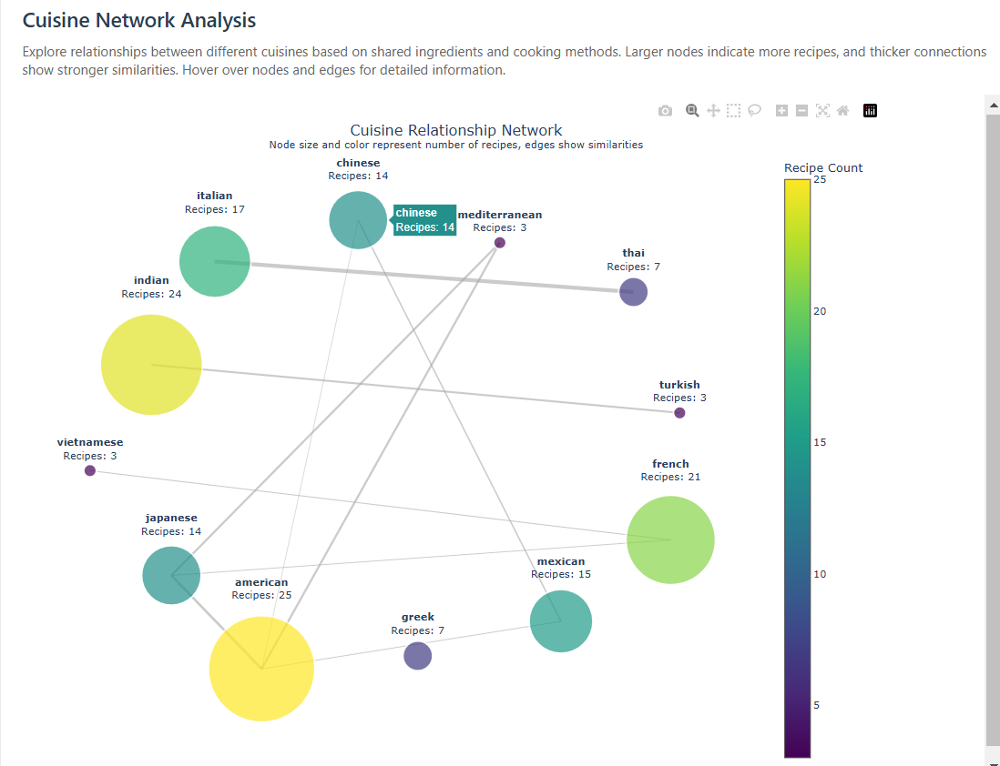
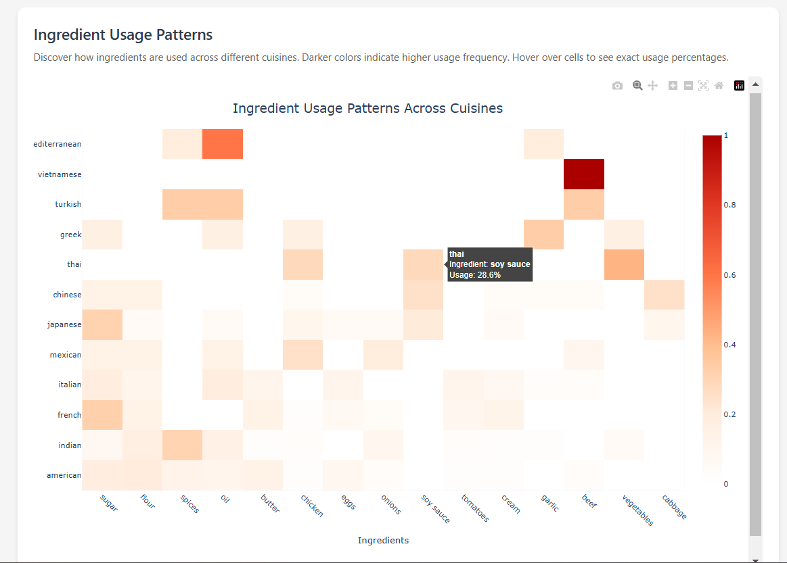
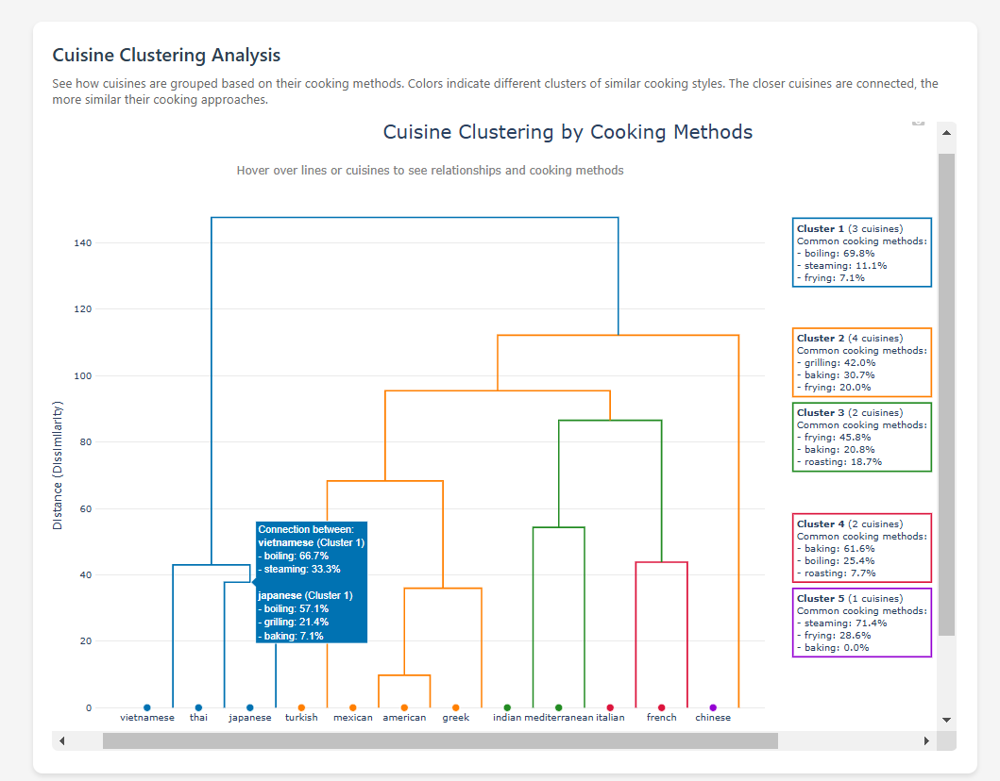

# Culinary Connections - Recipe Analysis System 🍳

## Overview
Culinary Connections is a recipe analysis system that uncovers patterns and relationships in global cuisine using advanced machine learning techniques. The project analyzes recipes based on ingredients, cooking methods, and cultural influences to provide interactive visualizations and insights.

---

## 🌟 Features

### Core Functionality
- **Interactive cuisine network visualization**
- **Ingredient usage pattern analysis**
- **Hierarchical cuisine clustering**
- **Recipe similarity detection**
- **Cross-cultural cooking pattern analysis**

### Technical Highlights
- **Advanced clustering algorithms** (K-means, Hierarchical)
- **TF-IDF based ingredient analysis**
- **Interactive visualization dashboard**
- **Comprehensive similarity metrics**
- **Modular architecture**

---

## 🛠️ Installation

### Prerequisites
- **Python 3.8+**
- **pip**
- **Virtual environment** (recommended)

### Setup

1. **Clone the repository**
   ```bash
   git clone https://github.com/yeshapatel356/culinary-connections.git
   cd culinary-connections

## 📊 Visualization Examples

### Cuisine Network


### Ingredient Heatmap


### Cuisine Clustering



## 🚧 Future Enhancements
- Deep learning integration for recipe analysis
- Multi-language support
- Real-time recipe processing
- API development
- Integration with smart kitchen devices

## 🐛 Known Issues
- Limited to structured recipe data
- Fixed number of clusters in K-means
- Visualization size constraints
- No support for real-time updates
